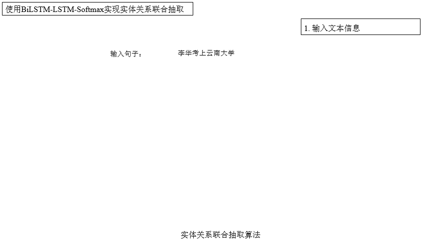

# 基于BiLSTM-LSTM-Softmax的实体关系联合抽取算法

## 算法演示

## 在线案例使用说明

- [算法示例](1_算法示例/README.md)
- [自测练习](3_自测练习/README.md)
- [扩展练习](4_扩展练习/README.md)

## 备注
- 本案例自动化安装了Anaconda，python环境为3.7，不需要用户手动安装，只需要等脚本运行安装完即可使用。
